## SDK-iOS使用说明书

欢迎使用“智慧服务平台”的在线客服移动端开发者工具套件（SDK）。本文针对iOS端使用做详细说明，通过SDK，可以在您的APP中快速集成访客端在线聊天的功能，以具备文本、图片、视频等类型消息收发

## 一、进入会话 

> 如果后台配置了欢迎语会在中心位置，系统提示欢迎语文案

二、发送文本

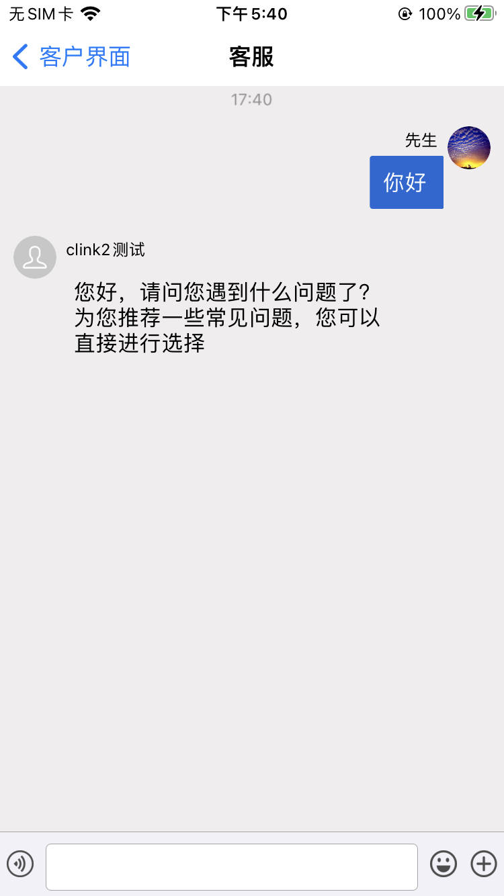

三、发送表情

> 仅支持天润系统内部表情库

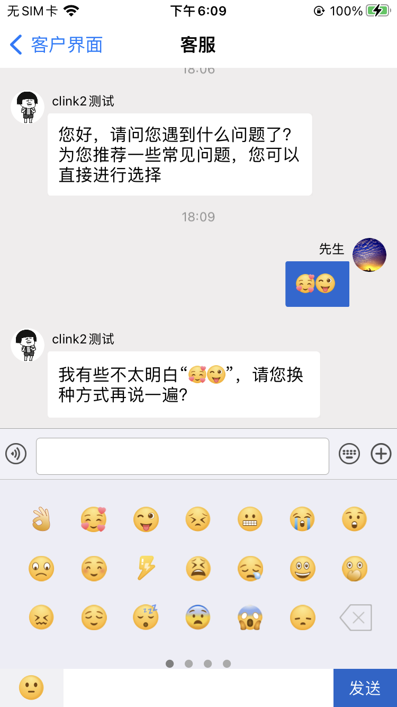

四、发送语音

<table rules="none" align="center">
	<tr>
		<td>
			

				
				 
				001.jpg
			

		</td>
		<td>
			

				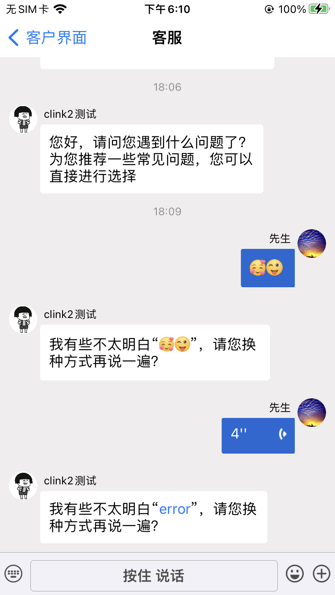
				 
				002.jpg
			

		</td>
	</tr>
</table>

五、发送图片

> 支持相册选择图片和拍摄照片，涂鸦、闪光灯、截图等功能，支持点选大图展示

<table rules="none" align="center">
	<tr>
		<td>
			

				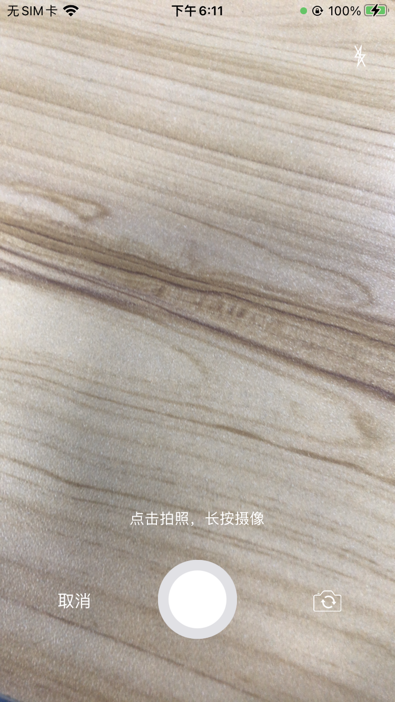
				 
				001.jpg
			

		</td>
		<td>
			

				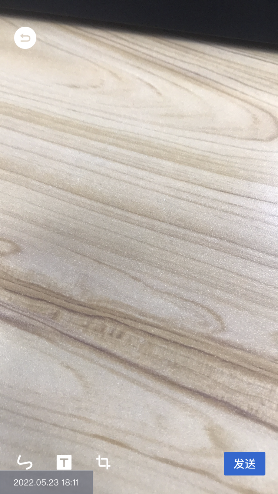
				 
				002.jpg
			

		</td>
        <td>
			

				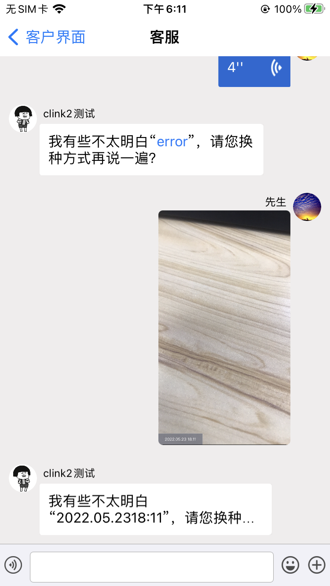
				 
				002.jpg
			

		</td>
	</tr>
</table>

五、发送视频

> 长按拍摄按钮支持拍摄视频,支持播放中暂停、恢复、下载

<table rules="none" align="center">
	<tr>
		<td>
			

				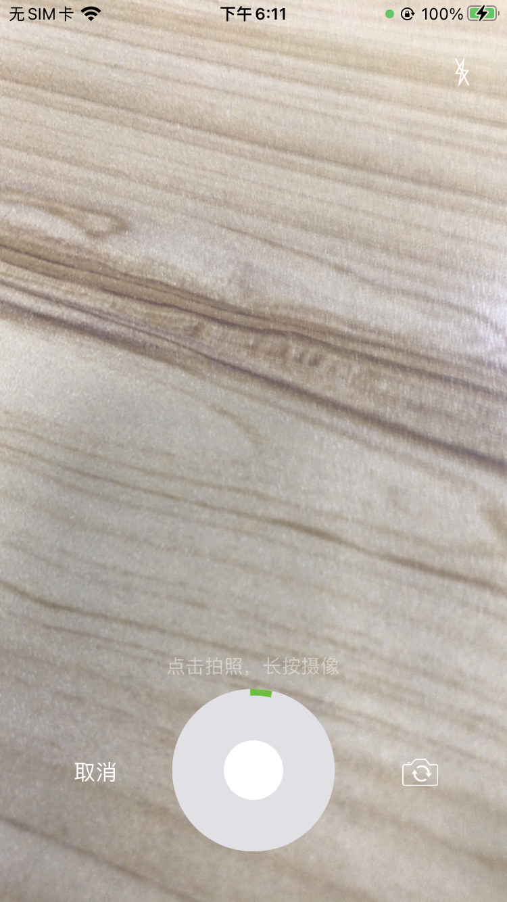
				 
				001.jpg
			

		</td>
		<td>
			

				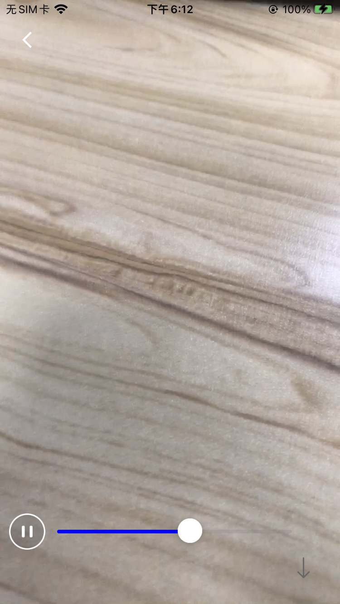
				 
				002.jpg
			

		</td>
	</tr>
</table>

五、发送文件

> 需要有icloud的配置

<table rules="none" align="center">
	<tr>
		<td>
			

				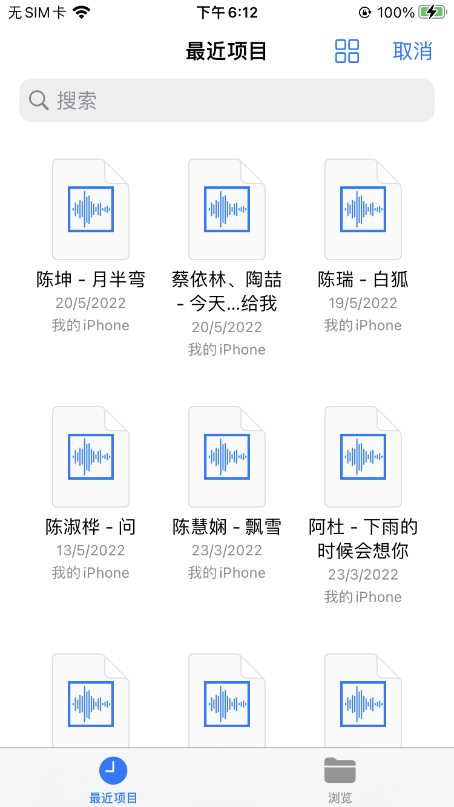
				 
				001.jpg
			

		</td>
		<td>
			

				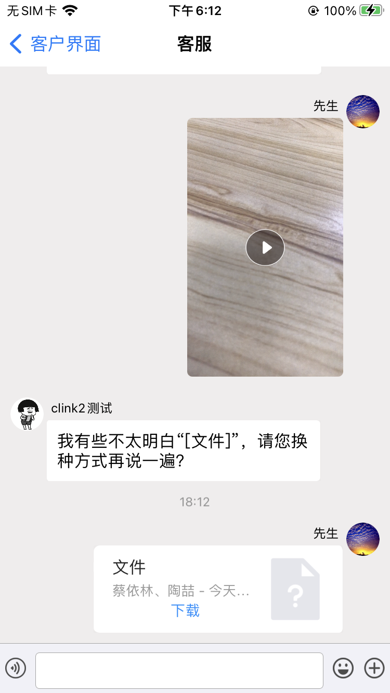
				 
				002.jpg
			

		</td>
	</tr>
</table>

六、转人工

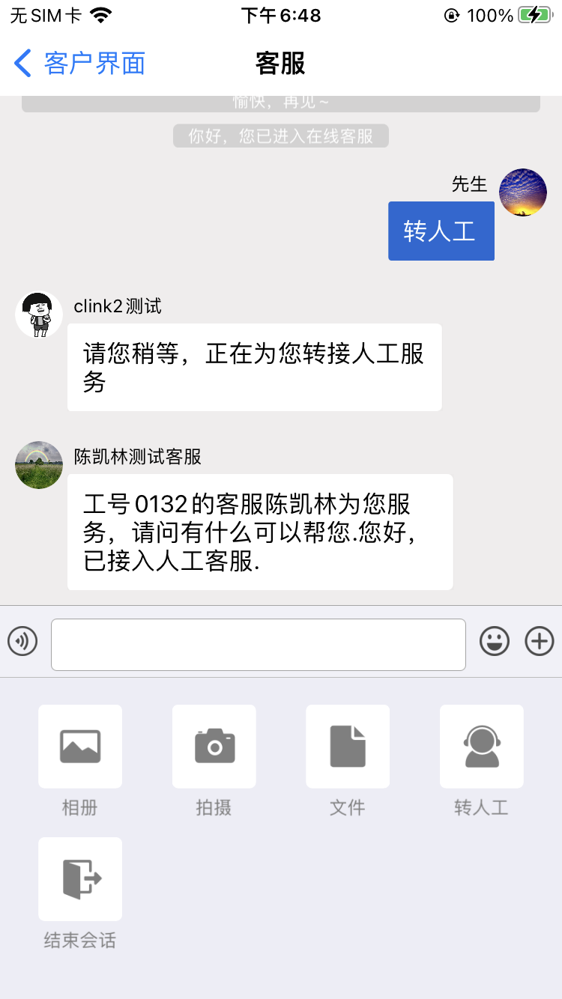

七、结束会话

