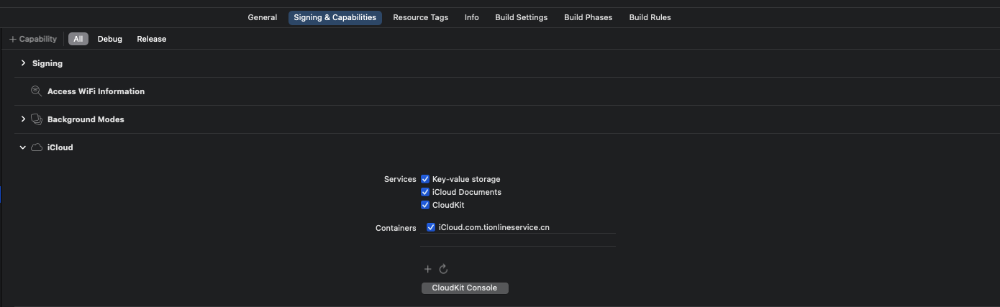

## 天润在线客服SDK-iOS接口文档

> 版本号: v1.2.3

## <font color=LightGreen size=4>一、概述</font> <div id="一"></div>

> 欢迎使用“智慧服务平台”的在线客服移动端开发者工具套件(SDK)。本文针对iOS端使用做详细说明，通过SDK，可以在您的APP中快速集成访客端在线聊天的功能，以具备文本，图片、视
频等类型消息收发及消息通知能力，

## <font color=LightGreen size=4>二、集成准备</font> <div id="一"></div>
#### 2.1 注册账号<div id="2.1"></div>    
请先确保已注册天润在线客服账号<a href=""></a>。

#### 2.2 开发环境<div id="2.2"></div>
- 适配iOS 10.0以上
- 开发工具：Xcode 13
- macOS: 11.6.1
#### 2.3 下载天润在线客服SDK<div id="2.3"></div>    
最新SDK包链接地址:
[iOS_SDK](https://github.com/ti-net/clink-sdk/tree/master/clink-appsdk/IOS/IOSOnlineSDK/SDK)     

#### 2.4 SDK文件说明 <div id="2.4"></div>   

解压下载【iOS_SDK】,下载完为一个压缩包，包含（<font color=Crimson size=2>TIMCilentLib.framework</font>、<font color=Crimson size=2>TIMCilentKit.framework</font>、<font color=Crimson size=2>TIMClinet.bundle</font>)和相关说明文档。


 文件名	| 说明
------------- | ------------  
<font color=Crimson size=2>TIMClinetKit.framework</font>|	SDK UI Kit
<font color=Crimson size=2>TIMClient.bundle</font>|	图片资源文件 表情资源文件
<font color=Crimson size=2>TIMCilentLib.framework	</font>|SDK Lib

#### 2.5 手动导入SDK和添加依赖库<div id="2.5"></div>
把下载的TIMClinetKit.framework 、TIMCilentLib.framework、TIMClient.bundle文件夹中的文件拖入你的工程里。
天润iOS_SDK 的实现，依赖了一些系统的框架，在开发应用时需要在工程里加入这些框架 ( TIMClientLib不包含UI界面，可根据接口自行开发功能 ) 。开发者首先点击工程右边的工程名，然后在工程名右边依次选择<font color= orange size=2>TARGETS -> BuiLd Phases -> Link Binary With Libraries</font>，展开 <font color= orange size=2>LinkBinary With Libraries</font> 后点击展开后下面的 + 来添加下面的依赖项:  

- TIMCilentLib.framework(Embed & Sign)
- TIMClientKit.framework(Embed & Sign)
- TIMClient.bundle
- 另外需要增加libc++.tbd来支持c++环境

#### 2.6 配置需要的权限<div id="2.6"></div>

> 在info.plist中添加如下两个配置(iCloud文件访问权限和证书)
  - Supports opening documents in place
  - Application supports iTunes file sharing

  - 结果均为YES

   证书配置详见：

   
> 相机、麦克风、相册等权限
 - Privacy - Camera Usage Description
 - Privacy - Microphone Usage Description
 - Privacy - Photo Library Additions Usage Description
 - Privacy - Photo Library Usage Description

#### 2.7 注意事项<div id="2.7"></div>    

> 注意：
>
> 1. 增加在APP的 Info.plist 文件中增加 CFBundleDisplayName，value值为APP名称
> 2. 在会话页面中关闭键盘管理的第三方控件，如：IQKeyboardManager
> 3. 如有需要，可在跳转会话页面前设置会话页面的titleName属性，修改顶部标题

## <font color=LightSeaGreen size=4>三、快速集成</font><div id="二"></div>  
#### 3.1 启动SDK<div id="3.1"></div>  
天润SDK提供了一套开源的聊天界面，帮助开发者快速集成，并提供自定义接口，以实现定制需求。只需以下几行代码便可快速启动天润SDK应用。

注: 请在链接客服服务成功后再调用创建会话接口

```
1.首先在AppDelegate中初始化SDK的Option
   // 初始化SDK参数，必须调用    
   IsDebug:                   是否在控制台打印内部调试信息
   apiUrl:                    IM 服务器地址        ex: @"https://octopus-api-1.vlink.cn/api/sdk/v1"
   onlineUrl:                 客服服务地址     ex: 北京平台为 @"https://chat-app-bj.clink.cn"
   accessSecret ：            参见 1.申请Appkey
   accessId ：                参见 1.申请Appkey
   enterpriseId ：            参见 1.申请Appkey
   [[OnlineInitOption shareOnlineInitOption] initWithOptionIsDebug:YES
                                                             apiUrl:@"IM 服务器地址"
                                                          onlineUrl:@"客服服务地址"
                                                       accessSecret:@"在座席端管理平台创建渠道时生成"
                                                           accessId:@"移动端唯一标识，对应座席端渠道ID"
                                                       enterpriseId:@"企业ID"]

2.连接客服服务
// UserId      访客Id,访客的唯一Id
// nickname    访客的昵称
// phoneNum    访客的手机号
// headerUrl   访客的头像Url
[[OnlineRequestManager sharedCustomerManager] getUserInfoWithUserId:@"访客Id"
    nickname:name                                                           
    phoneNum:phoneNum                                                        
    headerUrl:headerUrl                                                     
connectSuccess:^{    
  NSLog(@"链接成功");
} error:^(TIMConnectErrorCode errCode, NSString * _Nonnull errorDes) {
  [self showMBErrorView:@"网络请求错误，请检查网络"];
} tokenIncorrect:^{    
  [self showMBErrorView:@"accessSecret不正确"];
}];

```

#### 3.2 全局自定义配置 <div id="3.2"></div>
```
  // 本地kit一些配置
  [TIMKit sharedTIMKit].disableMessageNotificaiton = YES;  // 取消本地推送
  [TIMKit sharedTIMKit].disableMessageAlertSound = YES;    // 取消本地推送声音
  [TIMKit sharedTIMKit].customMessageClickDelagate = self; // 自定义消息点击事件回调
```

#### 3.3 创建会话<div id="3.3"></div>
> 连接客服服务成功后可创建会话

```
  // 创建会话
  // 当APP端IM mqtt 连接就绪，主动通知服务端，APP端调用该接口后服务端 就开始会话流程逻辑创建
  // params moreDict 自定义字典信息
  -(void)visitorReadyWithDict:(NSDictionary*)moreDict
                    success:(void (^)(NSString * mainUniqueId))successBlock
                      error:(void (^)(TIMConnectErrorCode errCode,NSString *errorDes))errorBlock
  [[OnlineRequestManager sharedCustomerManager] visitorReadyWithDict:(NSDictionary*)moreDict                 
  success:^(NSString * _Nonnull mainUniqueId) {  
    // 创建会话成功，进入聊天⻚面
    // mainUniqueId 即 会话Id
  } error:^(TIMConnectErrorCode errCode, NSString * _Nonnull errorDes) {

  }];

```

#### 3.4 获取未读数和最后一条消息<div id="3.4"></div>

```
  /**
   未读消息获取
  @param visitorId          当前用户ID
  @param mainUniqueId       会话ID （如果为空字符串就是获取总的未读消息数）
  */
  [[OnlineRequestManager sharedCustomerManager] sessionInfoUnreadCountCurrentVisitorId:[[OnlineDataSave shareOnlineDataSave] getVisitorId] WithMainUniqueId:[NSString stringWithFormat:@"%@", [[OnlineDataSave shareOnlineDataSave] getMainUniqueId].length>0 ? [[OnlineDataSave shareOnlineDataSave] getMainUniqueId] : @""] withSuccess:^(NSString * _Nonnull lastMessage, NSString * _Nonnull unreadCount) {
        NSLog(@"未读数：%@, 最后一条消息：%@", unreadCount, lastMessage);

  } withError:^(NSString * _Nonnull errorStr) {
      /// 错误提示
  }];

  // 未读数的更新  KVO监听
  KTIMLastMessageReceivedNotification

```

## <font color=LightGreen size=4>四、会话相关</font> <div id="四"></div>

#### 4.1 客服会话页面<div id="4.1"></div>

```
#import <TIMClientKit/TIMClientKit.h>

NS_ASSUME_NONNULL_BEGIN

@interface ChatInfoViewController : TIMCustomerChatVC

@end
```

#### 4.2 文本类型消息中关于链接、单号和手机号的相关点击回调 （更新于 v1.1.0）<div id="4.2"></div>
> 注：此方法需要在TIMCustomerChatVC类的子类中实现
```
typedef NS_ENUM(NSUInteger, TinetClickTextMessageEventType) {
    TinetClickEventTypeUrl,					      // 链接
    TinetClickEventTypeOrderNumber,				// 订单号
    TinetClickEventTypePhone			  	  	// 手机号
};

/// 文本类型消息中关于链接、订单号和手机号的相关点击回调
/// @param eventType 事件类型
/// @param userInfo  详细信息
- (void)tinet_textMessageClickAction:(TinetClickTextMessageEventType)eventType userInfo:(NSDictionary *)userInfo;

```

#### 4.3 会话状态监听<div id="4.2"></div>

> 注：此方法需要在TIMCustomerChatVC类的子类中实现

```
typedef NS_ENUM(NSUInteger, TinetChatStatusType) {
    TinetChatStatusTypeOutline,   // 不在线或结束会话
    TinetChatStatusTypeRobot,     // 机器人在线
    TinetChatStatusTypeOnline,    // 客服在线
};

/// @param status  会话状态
/// 当前会话状态监听
- (void)chatStatusChanged:(TinetChatStatusType)status;

```

## <font color=LightGreen size=4>五、自定义UI配置</font> <div id="五"></div>

```
修改自定义的参数在TIMClient.bundle中的customInfo.plist

1. 聊天背景色修改
ChatBackGround字典中使用RGBA的参数设置
   BackGroundColorR      (0 ~ 255.f)
   BackGroundColorG      (0 ~ 255.f)
   BackGroundColorB      (0 ~ 255.f)
   BackGroundColorA      (0.0 ~ 1.0f)

2.头像
Portrait字典中
   cornerRadius       圆角弧度 (0 ~ 10.f)  默认5

3.气泡颜色
SenderBubbleBackGround字典中
使用RGBA的参数设置
   BackGroundColorR      (0 ~ 255.f)
   BackGroundColorG      (0 ~ 255.f)
   BackGroundColorB      (0 ~ 255.f)
   BackGroundColorA      (0.0 ~ 1.0f)
圆角弧度
   cornerRadius          (0 ~ 10.f)  默认5

ReceiveBubbleBackGround字典中
使用RGBA的参数设置
   BackGroundColorR      (0 ~ 255.f)
   BackGroundColorG      (0 ~ 255.f)
   BackGroundColorB      (0 ~ 255.f)
   BackGroundColorA      (0.0 ~ 1.0f)
圆角弧度
   cornerRadius          (0 ~ 10.f)  默认5

4.商品卡片示例
    TIMCommodityCardOption *option = [[TIMCommodityCardOption alloc] init];
    option.subTitle = @"华为P40麒麟990 5G SoC芯片 5000万超感知徕卡三摄 30倍数字变焦";
    option.descriptions = @"这是商品描述，啦啦啦啦啦啦啦啦啦啦啦啦啦啦啦啦啦啦";
    option.price = @"100.99";
    option.time = @"2022/05/24 18:32";
    option.img = @"https://img2.baidu.com/it/u=3019548648,4204913203&fm=253&fmt=auto&app=138&f=JPEG?w=500&h=500";
    option.status = @"已到货";
    option.extraInfo =
    @[@{@"name": @"订单号", @"value": @"1234567890"},
    @{@"name": @"产品类型", @"value": @"电子产品"},
    @{@"name": @"师傅"   , @"value": @"金师傅"},
    @{@"name": @"服务地区", @"value": @"北京市"},
    @{@"name": @"服务"   , @"value": @"满意"},
    @{@"name": @"师傅电话", @"value": @"12345678900"},
    @{@"name": @"订单状态", @"value": @"已完成"}];

    chatVC.commodityCardOption = option;

 5.快捷入口配置
    chatVC.barItemDataArray = @[@"快捷入口1",@"快捷入口2",@"快捷入口3"];

/// 快捷入口的点击回调    index    点击索引从0开始（需要在子类实现这个方法）
- (void)bariItemDidTouchIndex:(NSInteger)index;

```

## <font color=LightGreen size=4>六、主要接口</font> <div id="六"></div>

```

#pragma mark  建立会话访客初始化
@params moreDict 扩展参数
@return mainUniqueId 为会话ID
-(void)visitorReadyWithDict:(NSDictionary*)moreDict
                    success:(void (^)(NSString * mainUniqueId))successBlock
                      error:(void (^)(TIMConnectErrorCode errCode,NSString *errorDes))errorBlock;

#pragma mark  获取历史消息
@params lastTime 查询起始时间(时间戳秒)
@params limit 查询的返回数量
-(void)getChatRecordListLastTime:(NSString *)lastTime
                           limit:(NSString *)limit
                         success:(void (^)(NSArray * chatList))successBlock
                           error:(void (^)(TIMConnectErrorCode errCode,NSString *errorDes))errorBlock;

#pragma mark  发送图片消息
@params imageData 二进制数据
@params result 返回的json
-(void)sendImgMessageWithImageData:(NSData *)imageData
                           success:(void (^)(NSDictionary * result))successBlock
                             error:(void (^)(TIMConnectErrorCode errCode,NSString *errorDes))errorBlock;

#pragma mark  发送语音消息
@params voiceData 二进制数据
-(void)sendVoiceMessageWithVoiceData:(NSData *)voiceData
                             success:(void (^)(void))successBlock
                               error:(void (^)(TIMConnectErrorCode errCode,NSString *errorDes))errorBlock;

#pragma mark  发送视频消息
@params videoData 二进制数据
-(void)sendVideoMessageWithVideoData:(NSData *)videoData
                             success:(void (^)(void))successBlock
                               error:(void (^)(TIMConnectErrorCode errCode,NSString *errorDes))errorBlock;

#pragma mark  发送文件消息
@params fileData 二进制数据
@params fileType 文件的mimeType
-(void)sendFileMessageWithFileData:(NSData *)fileData
                          fileType:(NSString *)fileType
                             success:(void (^)(void))successBlock
                               error:(void (^)(TIMConnectErrorCode errCode,NSString *errorDes))errorBlock;

```

## <font color=LightGreen size=4>七、退出客服</font> <div id="七"></div>

> 释放客服资源
```
/**
断开与TIM服务器的链接  
@param option  断开连接的对象实例  
@discussion 因为SDK在前后台切换或者网络出现异常都会自动重连，会保证连接的可靠性。 所以除非您的App逻辑需要登出，否则一般不需要调用此方法进行手动断开。
*/
- (void)disconnect:(TIMDisConnectOption*)option success:(void (^)(void))successBlock error:(void (^)(TIMConnectErrorCode errCode,NSString *errorDes))errorBlock;
```

## <font color=LightGreen size=4>八、详细参数说明 </font>
<div id="八"></div>  

#### 8.1 消息

| 消息类型 | objectName | 描述            |
| ------------ | -------------- | -------------------- |
| 文本消息     | TextMessage    | 文本消息（包含表情） |
| 图片消息     | ImageMessage   | 图片消息             |
| 语音消息     | VoiceMessage   | 语音消息             |
| 视频消息     | VideoMessage   | 视频消息             |
| 文件消息     | FileMessage    | 文件消息             |
| 富文件消息   | RichTextMessage | 富文件消息             |
| 系统消息     | SystemMessage    | 系统消息             |
| 离开会话消息     | ChatLeaveReceiveMessage    | 离开会话消息         |

#### 8.2 消息类型

| 参数名                        | 参数值 | 说明                   |
| ----------------------------- | ------ | ---------------------- |
| MESSAGE_TEXT                          | 1      | 文本消息               |
| MESSAGE_IMAGE                         | 2      | 图片消息               |
| MESSAGE_FILE                          | 3      | 文件消息               |
| MESSAGE_VIDEO                         | 4      | 视频消息               |
| ROBOT_HTML                    | 5      | 机器人富文本消息       |
| ROBOT_CHOOSE                  | 6      | 机器人选项消息         |
| MESSAGE_VOICE                         | 7      | 语音消息               |
| KNOW_LEDGE                    | 8      | 知识库文件消息         |
| CARD                          | 10     | 卡片消息               |
| ROBOT_GROUP                   | 14     | 机器人组合消息         |
| ROBOT_ABOUT_QUESTION          | 15     | 机器人相关问题         |
| ROBOT_GUESS_QUESTION          | 16     | 机器人猜你想问         |
| ROBOT_COMMON_QUESTION         | 17     | 机器人常见问题         |
| ROBOT_APPROX_QUESTION         | 18     | 机器人近似问题         |
| ROBOT_COMMENT_QUESTION        | 19     | 机器人推荐问题         |
| ROBOT_COMMON_QUESTION_CLASSIC | 20     | 机器人常见问题（分类） |

#### 8.3 事件


| 参数名               | 参数值             | 说明         |
| ------------------------- | ----------------------- | ---------------- |
| CHAT_MESSAGE              | chatMessage             | 聊天消息         |
| CHAT_BRIDGE               | chatBridge              | 接通座席         |
| CHAT_CLOSE                | chatClose               | 关闭座席         |
| CHAT_LEAVE_MESSAGE        | chatLeaveMessage        | 留言消息         |
| ROBOT_BRIDGE              | robotBridge             | 接通机器人       |
| CHAT_OPEN                 | chatOpen                | 会话开始         |
| CHAT_QUEUE                | chatQueue               | 进入排队         |
| CHAT_LOCATION             | chatLocation            | 排队位置播报     |
| CHAT_INVESTIGATION        | chatInvestigation       | 满意度           |
| WITHDRAW                  | withdraw                | 座席撤回消息     |
| CHAT_SWITCH               | chatSwitch              | 分支节点         |
| CHAT_LEADING_WORDS        | chatLeadingWords        | 引导语           |
| CHAT_INQUIRY              | chatInquiry             | 询前表单         |
| CHAT_OFFLINE              | chatOffline             | 访客离线         |
| CHAT_ONLINE               | chatOnline              | 访客上线         |
| CHAT_LEAVE_QUEUE          | chatLeaveQueue          | 访客退出排队     |
| CHAT_SWITCH_NEXT          | chatSwitchNext          | 访客选择节点     |
| CHAT_SUBMIT_INVESTIGATION | chatSubmitInvestigation | 访客提交满意度   |
| CHAT_SUBMIT_INQUIRY       | chatSubmitInquiry       | 访客提交询前表单 |

#### 8.4 消息发送人类型

| 参数名 | 参数值 | 说明 |
| ---------- | ---------- | -------- |
| ONLINE_SENDER     | 1          | 座席     |
| VISITOR_SENDER    | 2          | 访客     |
| SYSTEM_SENDER     | 3          | 系统     |
| ROBOT_SENDER      | 4          | 机器人   |
| NOTIFY_SENDER     | 5          | 系统通知 |

#### 8.5 会话状态监听

| 参数名                     | 参数值 | 说明           |
| -------------------------- | ------ | -------------- |
| TinetChatStatusTypeOutline | 0      | 离线或结束会话 |
| TinetChatStatusTypeRobot   | 1      | 机器人         |
| TinetChatStatusTypeOnline  | 2      | 客服           |

